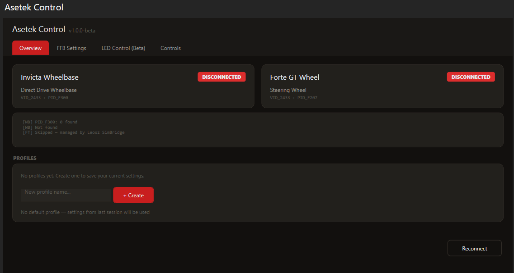

# Asetek Control — SimHub Plugin for Invicta & Forte

> **Beta Release — v1.0.0-beta**

A SimHub plugin that brings **direct FFB settings control**, **True Steering Lock**, **per-game profiles**, and **LED control** to Asetek SimSports wheelbases and Forte GT steering wheels — all from within SimHub.

---

## ⚠️ IMPORTANT DISCLAIMER

**This plugin is an independent, community-driven project.**

- This plugin is **NOT affiliated with, endorsed by, or supported by Asetek SimSports** or any of its subsidiaries.
- This is a **beta release** — features may not work as expected on all configurations. **Use at your own risk.**
- This plugin communicates with Asetek hardware via the standard HID (Human Interface Device) protocol, the same USB interface used by any compatible software.
- **No warranty** is provided, express or implied. The authors are not responsible for any damage, misconfiguration, or unexpected behavior that may result from using this plugin.
- This plugin **may stop working** after a firmware update from Asetek.
- **RaceHub must be closed** before launching SimHub with this plugin — both applications cannot access the wheelbase simultaneously.
- By using this plugin, you acknowledge that you understand these limitations and accept full responsibility.

### Why this plugin exists

The goal of this plugin is to fill gaps that the official Asetek software (RaceHub) does not currently address yet:

1. **True Steering Lock** — Automatically match the wheelbase steering range to the car you're driving (e.g., 380° for a Hypercar, 540° for a GT3). No more manual adjustment between sessions. Works on LMU now.
2. **In-game FFB adjustment** — Change FFB strength directly from your wheel buttons while driving, without alt-tabbing to RaceHub.
3. **Per-game / per-car profiles** — Create unlimited FFB profiles and switch between them instantly. Save your perfect setup for each sim and each car.

These are features the Asetek community has been requesting for a long time, and this plugin aims to deliver them through SimHub's ecosystem.

---

## Features

### ✅ Confirmed Working

| Feature | Status | Description |
|---------|--------|-------------|
| **True Steering Lock** | Stable | Auto-syncs steering range from the game via LMU REST API. The wheelbase range matches the car automatically |

### 🧪 Beta

| Feature | Status | Description |
|---------|--------|-------------|
| **FFB Settings** | Beta | Full control of all wheelbase parameters: Overall Force, Steering Range, Damping, Friction, Inertia, Anti-Oscillation, Torque Prediction, Slew Rate, HF Limit, Cornering Assist, Bumpstop. Only steering range fully tested so far |
| **FFB Strength +/-** | Beta | Bindable SimHub actions — assign to wheel buttons for on-the-fly force adjustment without leaving the cockpit |
| **Steering Range Presets** | Beta | Quick-switch between 360° / 540° / 900° / 1080° via bindable buttons |
| **Force Presets** | Beta | Quick-switch between Low (10 Nm) / Medium (18 Nm) / High (24 Nm) / Max (27 Nm) |
| **Software Profiles** | Beta | Unlimited profiles with save/load/rename/delete. Set a default profile loaded at startup |
| **Apply & Save to Flash** | Beta | Send settings to the wheelbase and persist to flash memory |
| **Wheelbase Center LED** | Beta | Set the center LED color, flag mode (auto-color based on race flags) |
| **Forte Rev Lights** | Beta | External control of the rev light strip from game telemetry |

---

## Screenshots

### Overview — Device Status & Profiles

### FFB Settings — Full Parameter Control

### LED Control (Beta)

### Controls — Button Mapping

---

## Supported Hardware

- **Asetek Invicta Wheelbase** (VID_2433 : PID_F300)
- **Asetek Forte GT Steering Wheel** (VID_2433 : PID_F207)

Other Asetek wheelbases or wheels may work but have not been tested.

---

## Installation

1. **Close RaceHub** if it is running
2. Download `AsetekPlugin.dll` from the [Releases](../../releases) page
3. Copy `AsetekPlugin.dll` into your SimHub installation folder (e.g., `C:\Program Files (x86)\SimHub\`)
4. Launch SimHub — the plugin appears as **"Asetek Control"** in the left menu

---

## Tabs Overview

### Overview
Device connection status (Invicta + Forte), diagnostics, and profile management.

- **Device cards** — Shows connection status for the Invicta wheelbase and Forte GT wheel with hardware IDs
- **Profiles** — Create, load, rename, delete, and set default profiles. Each profile stores all FFB settings, True Steering Lock state, and FFB step size
- **Diagnostics** — Raw HID communication log for troubleshooting
- **Reconnect** — Re-scan for Asetek devices without restarting SimHub

### FFB Settings
All wheelbase FFB parameters with sliders matching the values available in RaceHub.

- **Core** — Steering Range (180°–1890°) and Overall Force (3–27 Nm)
- **Mechanical Feel** — Damping, Friction, Inertia, Anti-Oscillation (0–100%)
- **Torque Shaping** — Torque Prediction (0–10), Torque Accel Limit (0.1–9.4 Nm/ms), High Frequency Limit (0–4700 Hz)
- **Bumpstop & Cornering** — Cornering Force Assist (0–100%), Bumpstop Hardness (Soft/Medium/Hard), Bumpstop Range (-90°–+90°)
- **Game Integration** — True Steering Lock checkbox (auto-sync from game), link to Controls tab
- **Apply & Save** — Sends all slider values to the wheelbase and persists to flash memory. On first use, set all sliders to match your current RaceHub values

### LED Control (Beta)
Wheelbase center LED color control and Forte rev light customization. This feature is not fully tested yet.

- **Wheelbase Center LED** — Flag Mode (auto-color based on race flags), test colors (Red, Green, Blue, Yellow, White, Orange, Purple, Off)
- **Forte Rev Lights** — RPM Telemetry toggle for external control, pattern presets (Segmented, Blue→Red, Red→Yellow, Green→Red)

### Controls
Assign wheel buttons, joystick buttons, or keyboard keys to any plugin action using SimHub's native ControlsEditor.

- **FFB Strength** — FFB Strength + / FFB Strength −
- **Steering Range Presets** — 360° / 540° / 900° / 1080°
- **Force Presets** — Low (10 Nm) / Medium (18 Nm) / High (24 Nm) / Max (27 Nm)
- **Toggles** — True Steering Lock
- **LED Modes** — LED Off / Flag Mode / Telemetry Mode
- **Device** — Apply & Save / Reconnect

---

## How It Works

### Communication
The plugin communicates with the Invicta wheelbase and Forte GT wheel via **HID (Human Interface Device)** — the standard USB protocol for input devices. It opens the device handle, sends configuration packets, and the wheelbase applies them immediately.

### FFB Settings
Each FFB parameter corresponds to a specific address in the wheelbase profile memory. When you click **Apply & Save**, the plugin sends 3 batches of settings to the active profile, followed by a save-to-flash command. Settings are applied immediately — no restart required.

### True Steering Lock
When enabled, the plugin queries the **LMU REST API** (port 6397) for the current car's steering lock value (e.g., `VM_STEER_LOCK = "450deg"`). It then automatically sets the wheelbase steering range to match. This happens on car change and retries every ~2 seconds until resolved.

### Profiles
Profiles are stored locally as JSON in `%APPDATA%\AsetekPlugin\profiles.json`. Each profile captures:
- All FFB parameter values (steering range, force, damping, friction, etc.)
- True Steering Lock on/off state
- FFB step size for +/- buttons

You can set a **default profile** that loads automatically when SimHub starts.

### Settings Persistence
The wheelbase does not expose a "read settings" command. The plugin maintains a local cache of all settings and persists them in `%APPDATA%\AsetekPlugin\ffb_settings.json`. On first use, make sure to configure all sliders to match your current RaceHub values before applying.

---

## SimHub Properties (for dashboard developers)

The plugin exposes the following SimHub properties that can be used in custom dashboards:

| Property | Type | Description |
|----------|------|-------------|
| `Asetek.WheelbaseConnected` | bool | Invicta wheelbase detected |
| `Asetek.ForteConnected` | bool | Forte GT wheel detected |
| `Asetek.Led.Mode` | string | Current LED mode (off/flag/telemetry) |
| `Asetek.FFB.TrueSteeringLock` | bool | True Steering Lock enabled |
| `Asetek.FFB.CurrentStrength` | int | Current FFB strength (main_gain 0–100) |
| `Asetek.FFB.SteeringRange` | int | Current steering range in degrees |
| `Asetek.TSL.Debug` | string | True Steering Lock debug info |

---

## SimHub Actions (for button mapping)

| Action | Description |
|--------|-------------|
| `Asetek.FFB.Strength.Up` | Increase FFB strength |
| `Asetek.FFB.Strength.Down` | Decrease FFB strength |
| `Asetek.FFB.SteeringRange.360` | Set steering range to 360° |
| `Asetek.FFB.SteeringRange.540` | Set steering range to 540° |
| `Asetek.FFB.SteeringRange.900` | Set steering range to 900° |
| `Asetek.FFB.SteeringRange.1080` | Set steering range to 1080° |
| `Asetek.FFB.Force.Low` | Set force to 10 Nm |
| `Asetek.FFB.Force.Medium` | Set force to 18 Nm |
| `Asetek.FFB.Force.High` | Set force to 24 Nm |
| `Asetek.FFB.Force.Max` | Set force to 27 Nm |
| `Asetek.FFB.TrueSteeringLock.Toggle` | Toggle True Steering Lock |
| `Asetek.ApplyAndSave` | Apply current settings & save to flash |
| `Asetek.Reconnect` | Reconnect to devices |
| `Asetek.Led.Off` | Turn off LEDs |
| `Asetek.Led.FlagMode` | Enable flag-based LED mode |
| `Asetek.Led.TelemetryMode` | Enable telemetry-based LED mode |

---

## Known Limitations

- **RaceHub conflict** — RaceHub and this plugin cannot run simultaneously. Close RaceHub before launching SimHub.
- **True Steering Lock** currently only works with **Le Mans Ultimate / rFactor 2** (requires the LMU REST API on port 6397). Support for other sims is planned.
- **LED features are in beta** — behavior may vary depending on firmware version.
- **Settings are not readable from the wheelbase** — the plugin persists your last settings locally. On first use, make sure to set all sliders to match your current RaceHub values before applying.
- **Forte GT HID conflict** — If Leoxz SimBridge is managing the Forte wheel, the plugin skips Forte enumeration to avoid conflicts.

---

## Troubleshooting

| Problem | Solution |
|---------|----------|
| Both devices show "DISCONNECTED" | Close RaceHub, click Reconnect |
| Wheelbase shows "0 Found" | RaceHub is still running, or another app has the HID handle |
| Settings don't apply | Click "Apply & Save" — sliders only update the display until you apply |
| True Steering Lock shows "err" | Make sure LMU is running and in a session (not at the main menu) |
| Plugin doesn't appear in SimHub | Make sure `AsetekPlugin.dll` is in the SimHub root folder, not a subfolder |

---

## Roadmap

This plugin is under active development. Planned features include:

- [ ] Multi-sim True Steering Lock (ACC, iRacing, AMS2...)
- [ ] Auto-profile switching based on game/car
- [ ] LED patterns and animations
- [ ] Forte pedal telemetry integration
- [ ] Community-contributed profiles library

Feature requests and bug reports are welcome via [GitHub Issues](../../issues).

---

## License

MIT License — see [LICENSE](LICENSE) file.

This project is provided as-is with no warranty. See disclaimer above.

---

## Support

If you like this plugin and want to support its development:

---

*Made with passion by a sim racer, for sim racers.*
