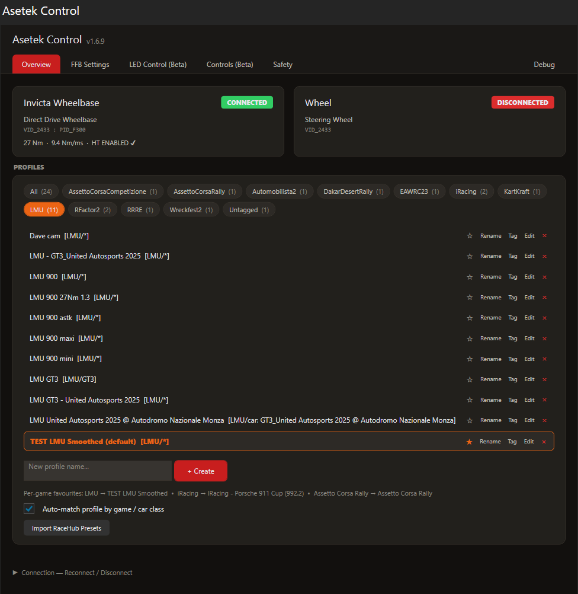
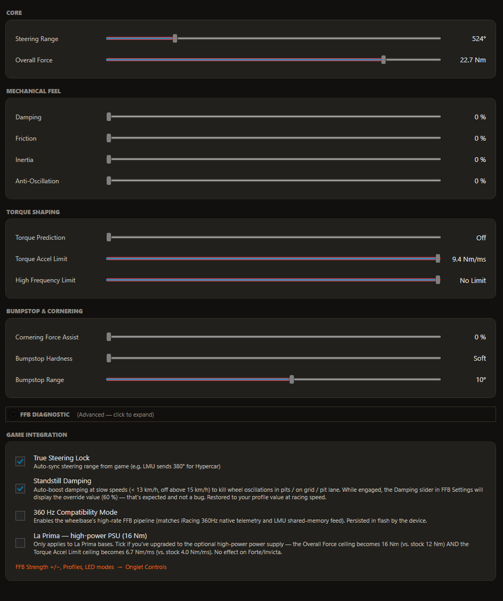
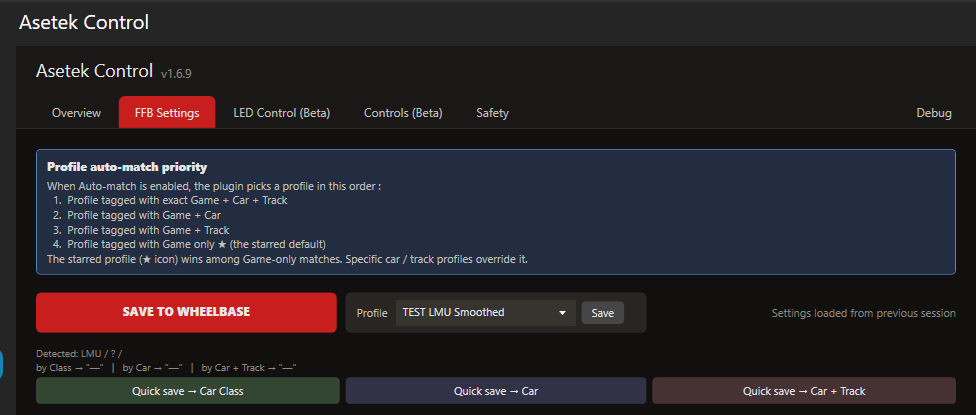
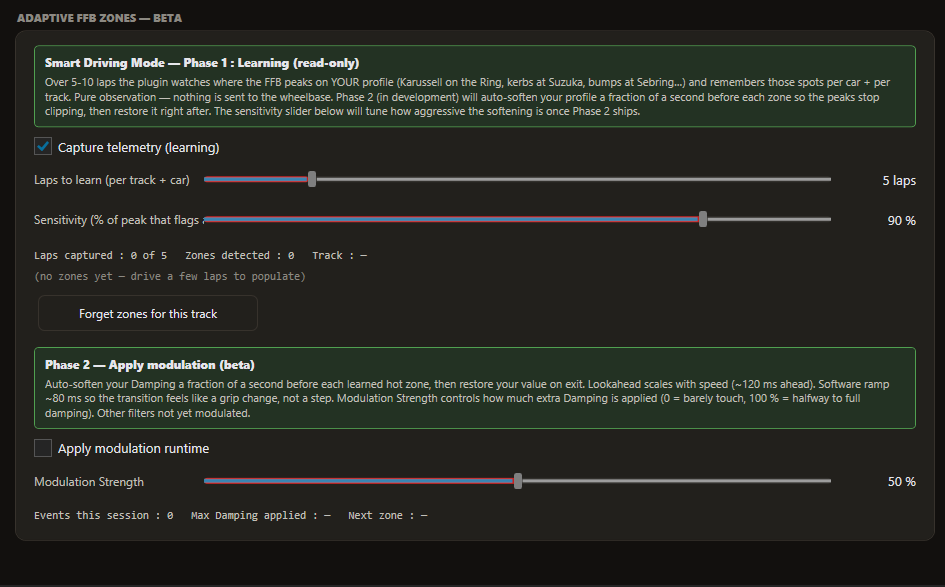
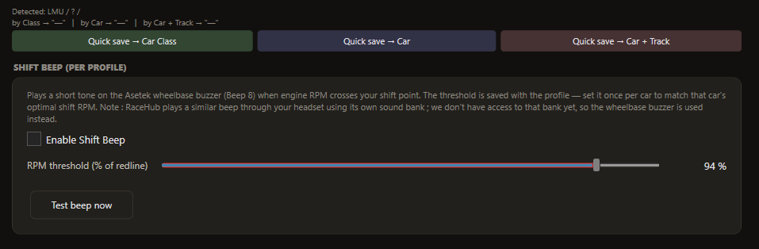
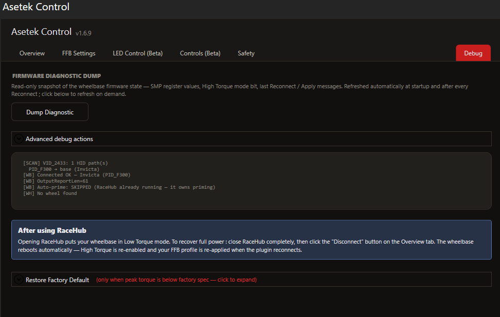

# Asetek Control — SimHub Plugin for Invicta, Forte, La Prima & Tony Kanaan

> **v1.6.9-beta — May 2026**

A SimHub plugin for **Asetek SimSports** wheelbases. Delivers **FFB output strictly identical to Asetek's native software** — and adds a **per-car / per-track profile system** that auto-loads the right setup when SimHub detects your active sim, car and track.

Independent, parallel project — not affiliated with Asetek SimSports or RaceHub. It complements Asetek's official software for users who want to drive their wheelbase from inside the SimHub ecosystem.

> 🐧 **Linux support** — Because the plugin runs inside SimHub, and SimHub for Linux now exists, this is the first time an Asetek wheelbase can be configured and tuned from a Linux machine (Ubuntu, Steam Deck OS, any desktop Linux). Same DLL, same features.

---

## Screenshots

### Overview — wheelbase summary at a glance

Detected base, single-line wheelbase summary (*"27 Nm · 9.4 Nm/ms · HT ENABLED ✓"*), profile selector with star-favourite per game, and the AutoMatch banner.

### FFB Core — all parameters, RaceHub-strict

All wheelbase parameters — Overall Force, Steering Range, Damping, Friction, Inertia, Anti-Oscillation, Torque Prediction, HF Limit, Cornering Assist, Bumpstop. Values delivered to the firmware are strictly identical to Asetek's native software.

### Quick-save bar — tag profiles by Car, Track, or both

One click creates a profile tagged with the current Game + Car + Track context. AutoMatch loads it back instantly the next time you race the same combo.

### Adaptive FFB Zones (beta)

Per-track, per-car learned softening of clipping zones. The plugin learns where you saturate FFB on each circuit and applies modulation only in those zones — full force everywhere else.

### Shift Beep & LED control

Configurable rev-light patterns, flag colours, and an optional shift beep — all driven by SimHub telemetry.

### Debug — for support, not daily use

Dump Diagnostic, RaceHub recovery banner, and advanced actions behind an expander. Most users will never need to open this tab.

---

## What this plugin does

- **FFB strictly matches Asetek's native software** on **Invicta, Forte, La Prima and Tony Kanaan editions**. No silent caps, no "feels light", no discrepancy between what the slider shows and what the wheel does. One click on *Restore Factory Default* (Debug tab) re-syncs the base if it ever feels off.
- **Per-car / per-track profile system** with a 9-tier AutoMatch priority — different setups for different car classes, different tracks, different conditions, auto-loaded when SimHub detects the active sim + car + track.
- **In-game FFB adjustment** via bindable SimHub actions — change strength, range, or cycle profiles from a wheel button.
- **RaceHub preset import** — bring your existing tuned FFB across in one click.

---

## Supported Hardware

| Model | PID | Peak Torque |
|-------|-----|-------------|
| Invicta | F300 | 27 Nm |
| Forte | F301 | 18 Nm |
| La Prima | F303 | 12 Nm (16 Nm with high-power PSU) |
| Tony Kanaan Signature Edition | F306 | 12 / 18 Nm |
| Forte GT Steering Wheel | F207 | — |
| Invicta Steering Wheel | F400 | — |
| Formula Forte Steering Wheel | F402 | — |

**Initium** (the entry-level / console-compatible base) is **not supported yet** — it uses a different communication protocol. Tell us in the Discord if you'd use it.

---

## What's next — community-driven

The FFB plumbing is now fully nailed down. From here we're opening the door to a new layer of features:

- **Smart FFB modulation** — already shipping as *Adaptive FFB Zones* beta
- **Live in-race tuning** with full slider response, no save/restart
- **External controllers** — bind base profiles, FFB strength, smart modes to a **Stream Deck / Loupedeck** for instant in-cockpit control
- More to come

**Roadmap is driven by the community.** Tell us in the Discord which features you'd actually use — that's what gets built next.

---

## Installation

1. Download `AsetekPlugin.dll` from the [Releases](../../releases) page
2. Copy it into your SimHub installation folder (e.g., `C:\Program Files (x86)\SimHub\`)
3. Launch SimHub — the plugin appears as **"Asetek Control"** in the left menu
4. If your base ever felt lighter than its rated torque, click *Restore Factory Default* (Debug tab) once after install.

---

## SimHub Actions (for button mapping)

| Action | Description |
|--------|-------------|
| `Asetek.FFB.Force.Low/Medium/High/Max` | Set force preset (% of detected base peak) |
| `Asetek.FFB.Strength.Up / Down` | Increase / decrease FFB strength |
| `Asetek.FFB.SteeringRange.360/540/900/1080` | Set steering range |
| `Asetek.FFB.TrueSteeringLock.Toggle` | Toggle True Steering Lock |
| `Asetek.Profile.GameCycle.Next / Prev` | Cycle profiles for the current game |
| `Asetek.ApplyAndSave` | Apply current settings and save to flash |
| `Asetek.Reconnect` | Reconnect to devices |

---

## Troubleshooting

| Problem | Solution |
|---------|----------|
| Base feels lighter than its rated torque | Click **Restore Factory Default** (Debug tab) once. |
| "RaceHub is running — paused" banner | Expected. Close RaceHub then click Reconnect. |
| Wheelbase shows "Not detected" | Another app has the HID handle. Close RaceHub, click Reconnect. |
| True Steering Lock shows "err" | Make sure LMU is running and in a session (not main menu). |

---

## License

MIT License — see [LICENSE](LICENSE).

---

## Support

If you like this plugin and want to support its development:

---

*Made by a sim racer, for sim racers.*
